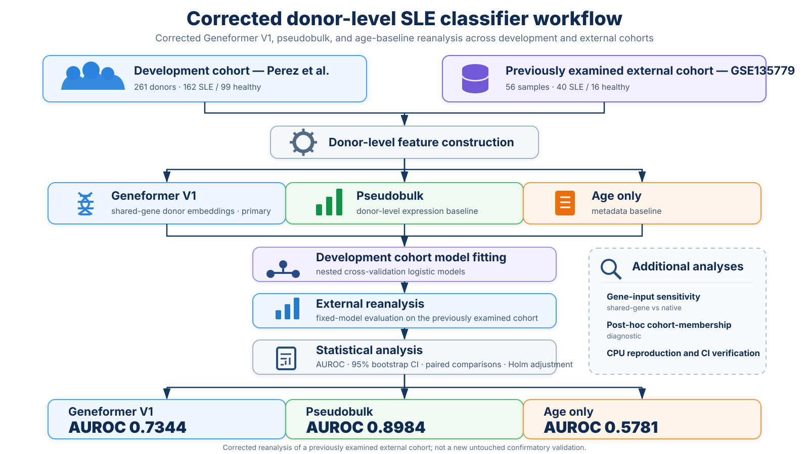

# External transport of donor-level SLE classifiers across two cohorts

[](https://github.com/mohamad679/lupus-singlecell-foundation/actions/workflows/reproducibility.yml)


Corrected Geneformer V1, pseudobulk, and age-baseline analysis for donor-level SLE-versus-healthy discrimination across a development cohort and a previously examined external cohort.



## Main corrected result

| Model | External n | AUROC | 95% bootstrap CI |
|---|---:|---:|---:|
| Corrected Geneformer V1, shared-gene input | 56 | **0.7344** | 0.6017–0.8597 |
| Pseudobulk | 56 | **0.8984** | 0.8080–0.9677 |
| Age only | 56 | **0.5781** | 0.3614–0.7815 |

Neither prespecified Geneformer-superiority comparison met its decision criterion. This is a **corrected reanalysis of an already examined external cohort**, not a new untouched confirmatory validation. No clinical-use, diagnostic-readiness, treatment, or deployment claim is made.

## Reproduce the reported corrected analysis

```bash
git clone https://github.com/mohamad679/lupus-singlecell-foundation.git
cd lupus-singlecell-foundation
bash scripts/reproduce.sh
```

The CPU reproduction refits the corrected shared/native analyses in an isolated directory and verifies donor alignment, selected regularization values, bounded cross-platform probability drift, reported AUROCs, and paired inference against the committed publication artifacts.

## Repository guide

- `scripts/` — seven numbered analysis steps, one reproduction launcher, and compact shared utilities.
- `results/published/` — authoritative corrected predictions, analyses, fitted reports, feature summaries, and provenance manifest.
- `results/reference/` — minimal historical/reference inputs needed by the corrected reproduction.
- `figures/main/` — four publication figures in PNG/PDF/TIFF.
- `notebooks/extraction/` — four self-contained GPU extraction notebooks.
- `tests/` — active regression tests for the corrected analysis and publication layout.
- `docs/` — data, methods, reproducibility, limitations, and provenance.
- `archive/` — historical development scaffolding, superseded analyses, tests, drafts, and legacy outputs.

## Documentation

- [Data and cohorts](docs/DATA.md)
- [Computational methods](docs/METHODS.md)
- [Reproducibility](docs/REPRODUCIBILITY.md)
- [Limitations](docs/LIMITATIONS.md)
- [Correction and provenance](docs/PROVENANCE.md)
- [Version history](CHANGELOG.md)

## Citation and archival release

Use [CITATION.cff](CITATION.cff) for software citation. Version **2.0.0** is the corrected publication package and is archived on Zenodo with the version-specific DOI **10.5281/zenodo.23135752**. The historical v1 release remains preserved separately for traceability.
